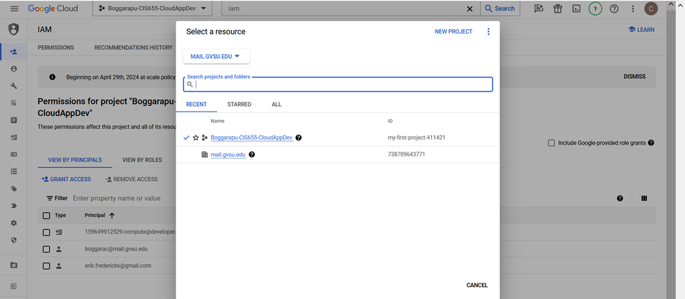
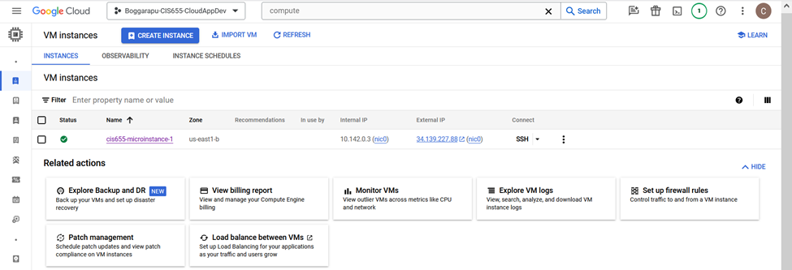
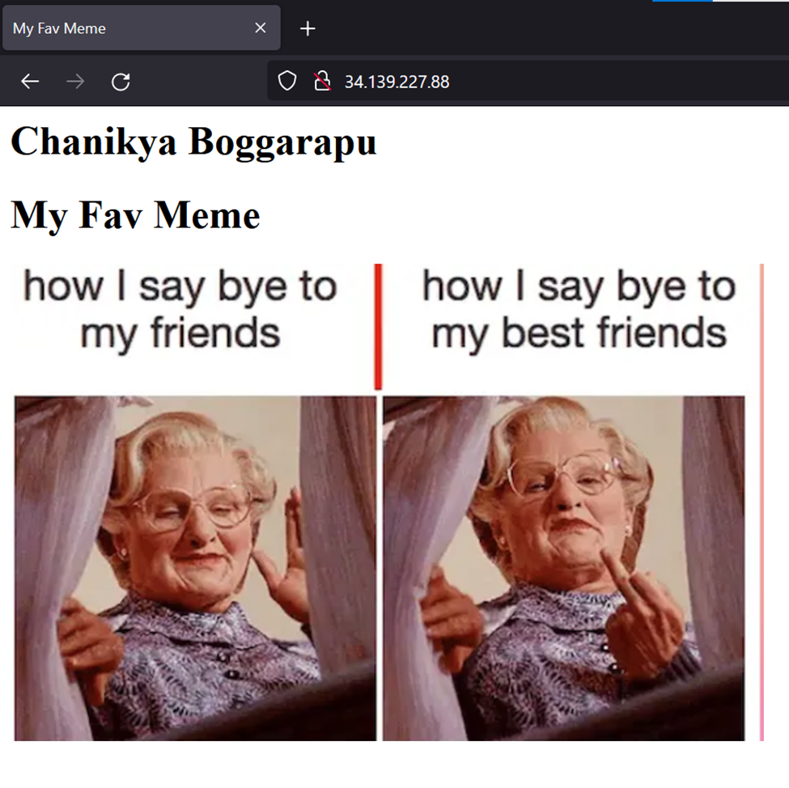

# 🌍 Cloud Setup & First Web Server  

## 🚀 Setting Up a Project & Compute Engine in GCP  

### **Step 1: Create a New Project**  
1. Open [Google Cloud Console](https://console.cloud.google.com/).  
2. In the top menu bar, click on **Select a project** and then **New Project**.  
3. Give your project a name (e.g., `my-cloud-project`).  
4. Link a **Billing Account** (free-tier covers most basic use cases).  
5. Click **Create** and wait for the project setup to finish.  



### **Step 2: Enable Compute Engine**  
1. In the left navigation menu, go to **APIs & Services > Library**.  
2. Search for **Compute Engine API** and click **Enable**.  
3. This will allow you to create and manage virtual machines on GCP.  

### **Step 3: Launch a Virtual Machine (VM)**  
1. In the left menu, go to **Compute Engine > VM Instances**.  
2. Click **Create Instance**.  
3. Fill in the following details:  
   - **Name**: Choose any name (e.g., `web-server-instance`).  
   - **Region & Zone**: Pick the nearest region for better performance (e.g., `us-central1-a`).  
   - **Machine Type**: Select `e2-micro` (this qualifies for the free-tier).  
4. In the **Boot Disk** section:  
   - Click **Change** and select **Ubuntu 22.04 LTS** as the OS.  
   - Click **Select** to confirm.  
5. Under **Firewall settings**, check:  
   - ✅ Allow HTTP traffic  
   - ✅ Allow HTTPS traffic  
6. Click **Create** and wait for your VM to launch.  



### **Step 4: Connect to the VM & Install a Web Server**  
1. Once the VM is running, click **SSH** to open a terminal.  
2. First, update the system packages:  
   ```bash
   sudo apt update
   ```
3. Install Apache (a simple web server) using:  
   ```bash
   sudo apt install apache2 -y
   ```
4. Restart Apache to make sure it’s running:  
   ```bash
   sudo systemctl restart apache2
   ```
5. Your web server is now up and running!  

### **Step 5: Add a Web Page**  
1. Navigate to the directory where Apache serves web pages:  
   ```bash
   cd /var/www/html
   ```
2. Create an `index.html` file:  
   ```bash
   sudo nano index.html
   ```
3. Paste the following HTML code inside the file:  
   ```html
   <html>
   <head>
       <title>My Favorite Meme</title>
   </head>
   <body>
       <h1>Chanikya Boggarapu</h1>
       <h1>My Favorite Meme</h1>
       
   </body>
   </html>
   ```
4. Save the file by pressing `CTRL + X`, then `Y`, and hit `Enter`.  
5. Restart Apache to apply the changes:  
   ```bash
   sudo systemctl restart apache2
   ```

### **Step 6: View Your Web Page**  
1. Copy the **External IP Address** of your VM from the Compute Engine page.  
2. Open a web browser and go to:  
   ```
   http://<YOUR_EXTERNAL_IP>/
   ```
   Example: [http://34.139.227.88/](http://34.139.227.88/)  

You should now see your meme displayed along with your name as below! 🎉  

