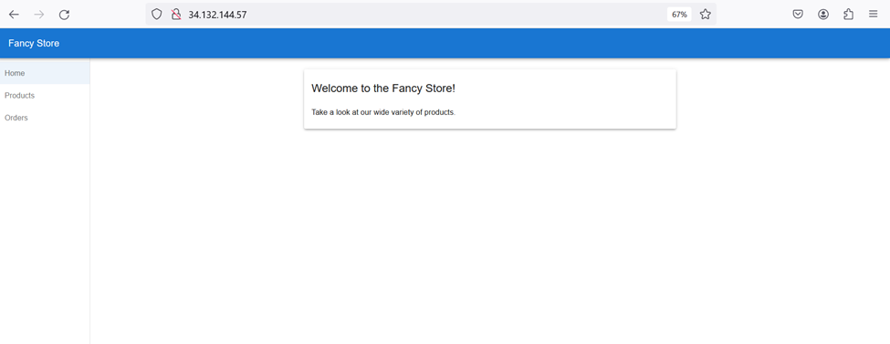
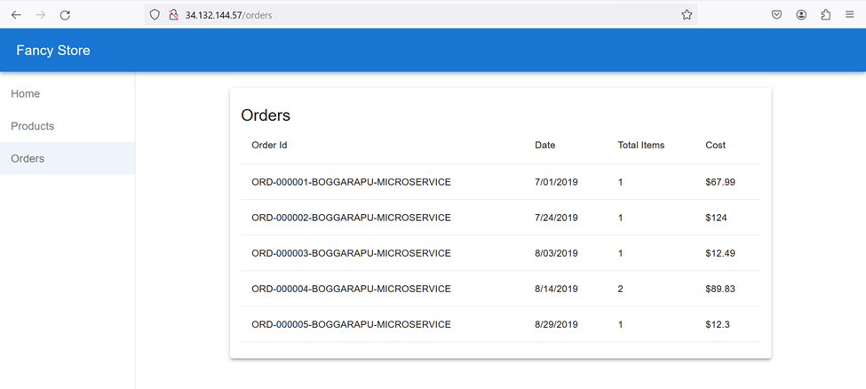
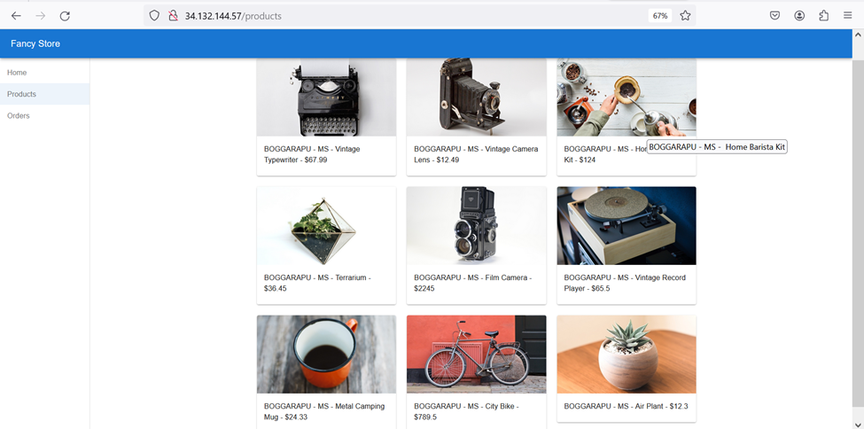

# Project-3 🌐 Fancy Store - Microservices-Based Application

## 🚀 Setting Up Microservices in GCP for Fancy Store

### **Step 1: Set Up a New Google Cloud Project**
1. Open [Google Cloud Console](https://console.cloud.google.com/).
2. In the top navigation bar, click on **Select a project** and then **New Project**.
3. Enter a project name (e.g., `fancy-store-project`).
4. Link your **Billing Account** (free-tier services are available for small-scale use).
5. Click **Create** and wait for the project to be initialized.

### **Step 2: Enable Required APIs in Google Cloud**
1. Go to **APIs & Services > Library**.
2. Search for and enable the following APIs:
   - **Google Kubernetes Engine API** for container orchestration.
   - **Cloud Run API** for serverless container deployment.
   - **Cloud Pub/Sub API** for inter-service communication.
   - **API Gateway API** for API management and routing.

### **Step 3: Set Up Google Kubernetes Engine (GKE) Cluster**
1. In the left menu, go to **Kubernetes Engine > Clusters**.
2. Click **Create Cluster**.
3. Choose a **Standard Cluster** and configure the settings:
   - **Cluster Name**: `fancy-store-cluster`.
   - **Location**: Select your region (e.g., `us-central1`).
4. Click **Create** to initialize the cluster.

### **Step 4: Deploy Microservices Using GKE**
1. First, containerize each microservice (Home, Orders, Products) using Docker:
   - Create a Dockerfile for each service.
   - Build the Docker image and push it to **Google Container Registry**.

2. Use **kubectl** to deploy the microservices:
   ```bash
   kubectl create -f home-service-deployment.yaml
   kubectl create -f orders-service-deployment.yaml
   kubectl create -f products-service-deployment.yaml
   ```

3. Expose each service via a **LoadBalancer** or use **Ingress** for routing.

### **Step 5: Set Up Cloud Run for Serverless Services**
1. Go to **Cloud Run > Create Service**.
2. Select the container image for the **Home** and **Orders** services.
3. Choose the **Region** and configure the service settings:
   - **Allow unauthenticated invocations** if public access is needed.
   - Set the environment variables as necessary (e.g., database credentials).
4. Click **Deploy** to start the service.

### **Step 6: Configure API Gateway for Routing**
1. Go to **API Gateway > Create API**.
2. Define an **API** to route requests to different microservices:
   - Define routes for `/home`, `/orders`, `/products`.
   - Set up HTTP methods (GET, POST) for each service route.
3. Deploy the API and note down the API Gateway URL for accessing the services.

### **Step 7: Implement Inter-Service Communication with Cloud Pub/Sub**
1. Set up **Cloud Pub/Sub** for asynchronous communication between services:
   - Create topics for each service (e.g., `order-created`, `product-updated`).
   - Configure each service to publish and subscribe to the relevant topics.

   ```bash
   gcloud pubsub topics create order-created
   gcloud pubsub topics create product-updated
   ```

2. For example, when an order is placed, the **Orders Service** publishes an event to the `order-created` topic, and the **Products Service** updates the product inventory.

### **Step 8: Monitor and Optimize Services**
1. Use **Google Cloud Monitoring** and **Cloud Logging** to track the health and performance of each microservice.
2. Set up custom dashboards to monitor service latency, error rates, and resource utilization.
3. Optimize service performance based on insights gathered from Stackdriver Trace.

## 📸 Screenshots of Fancy Store

Below are the screenshots of the **Fancy Store** application:

1. **Home Page**  
   - Displays featured products and promotional banners.

2. **Orders Page**  
   - Allows customers to place orders and view their order history.

3. **Products Page**  
   - Displays product listings with details such as price and availability.



## 🧠 Microservices: When to Use and When Not To

### I) **Advantages of Microservices:**

1. **Ice Cream Shop Analogy:**  
   Imagine running an ice cream shop. Each flavor (vanilla, chocolate, strawberry) is like a microservice. You can change the recipe of one flavor (service) without affecting the others, like tweaking strawberry’s recipe without changing vanilla or chocolate. Microservices allow independent modification without disrupting the whole system.

2. **City Transportation System Analogy:**  
   Think of buses, trains, and taxis as independent microservices in a city. You can improve the bus schedule without affecting the train or taxi service. Each service can be optimized independently, making the system more flexible and scalable.

### II) **When Not to Use Microservices:**

1. **Small Online Store:**  
   If you’re building a simple store with a few products, a cart, and checkout, microservices might overcomplicate things. It’s more efficient to handle the whole system with a single service.

2. **Traditional Banking System:**  
   In a bank, handling transactions, money, and loans with multiple microservices may create unnecessary complexity. A single, centralized system is more suitable for strict security, regulation, and coordination in such a scenario.


## 🎉 Conclusion

This project gave me valuable insights into the world of **microservices architecture**, and the **Fancy Store** application showcases how microservices can be implemented for real-world applications using **Google Cloud Platform (GCP)**. With each microservice responsible for distinct functionalities (Home, Orders, and Products), the system is scalable, flexible, and maintainable. The application was deployed using **GKE**, **Cloud Run**, **API Gateway**, and **Cloud Pub/Sub**, and is optimized for performance and monitoring.