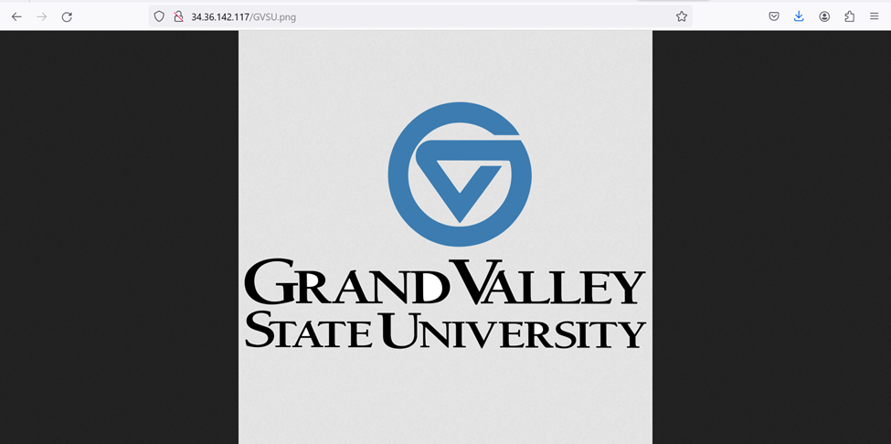

# 🌐 Project 4: Cloud Synthesis - HTTP Load Balancer with Cloud Storage

## 🚀 Overview & Goal

The main objective of this project is to **create a robust HTTP Load Balancer** that efficiently handles incoming HTTP requests and delivers content from a Cloud Storage bucket. The project aims to enhance content delivery speed and ensure global distribution. The steps involve setting up a Cloud Storage bucket, uploading files, and configuring an HTTP Load Balancer to deliver these files publicly.

## 💻 Services Used

### 1. **Cloud Storage Bucket**
Cloud Storage is used to store files and objects, and make them publicly accessible. The bucket allows for efficient file storage and easy access over the internet.

- **Usage**: 
  - Creating a storage bucket with specified regions and permissions.
  - Uploading an object into the bucket and configuring its access permissions for public accessibility.

### 2. **HTTP Load Balancer**
The Load Balancer ensures that HTTP traffic is routed efficiently, improving speed and distribution. It connects to the Cloud Storage bucket, delivering its contents globally.

- **Usage**: 
  - Setting up an HTTP Load Balancer with a backend bucket linked to the Cloud Storage bucket.
  - Configuring frontend and backend settings to handle HTTP requests and deliver stored content.

## 🔗 Links to Product Pages

- **Cloud Storage Documentation**: [Link](https://cloud.google.com/storage/docs/discover-object-storage-console)
- **HTTP Load Balancer Documentation**: [Link](https://cloud.google.com/load-balancing/docs/https)

## 🛠 Technical Setup

### Step 1: **Creating Cloud Storage Bucket**

1. **Create Cloud Storage Bucket**:
    - In the Google Cloud Console, navigate to **Cloud Storage** and create a new bucket.
    - Provide a unique name and select a region.
    - Set **Access Control** to fine-grained with **public access prevention** unchecked.

2. **Upload an Object**:
    - After creating the bucket, upload an object (e.g., image or HTML file).
    - Configure the uploaded object’s permissions to allow **public access**.

### Step 2: **Creating HTTP Load Balancer**

1. **Create Load Balancer**:
    - Navigate to **Network Services > Load Balancing** in the Google Cloud Console.
    - Click **Create Load Balancer** and select **HTTP(S) Load Balancer**.
    - Configure the **Frontend** settings to use **HTTP**, **Ephemeral IP Address**, and select the **Premium Tier** for global distribution.

2. **Frontend Configuration**:
    - Set the frontend to accept HTTP traffic and assign an ephemeral IP address for the Load Balancer.

3. **Backend Configuration**:
    - Link the backend to the previously created Cloud Storage bucket (use it as a backend bucket).

4. **Configure Host and Path Rules**:
    - Set up rules to route any incoming HTTP requests to the backend bucket.

5. **Retrieve Load Balancer IP**:
    - After reviewing the configuration, click **Create**.
    - Retrieve the **IP address** of the Load Balancer, which will be used to access the stored files.

## 📸 Screenshots Demonstrating the Application in Action

### 1. **Curl Test Result - HTTP Response:**
   - **Curl Command Result**: The test confirms that traffic has passed through the load balancer successfully with a **200 OK** response.
   
   

### 2. **Accessing the Image in the Cloud Storage Bucket**:
   - URL: `http://36.26.142.117/GVSU.png`
   - The image stored in the Cloud Storage bucket loads successfully.
   

### 3. **Accessing HTML File with the Image**:
   - URL: `http://34.36.142.117/index.html`
   - The HTML file loads the stored image from the Cloud Storage bucket.
   

## 📝 Summary

By completing this project, we created a **Cloud Storage Bucket** to store files and set up an **HTTP Load Balancer** to efficiently serve these files over the internet. The load balancer ensures smooth and global content delivery by utilizing the premium network tier, and all files were made publicly accessible to allow easy sharing and access.

With the project, users can use the provided **Load Balancer IP** to access content stored in the Cloud Storage bucket, while the backend bucket handles the content distribution.