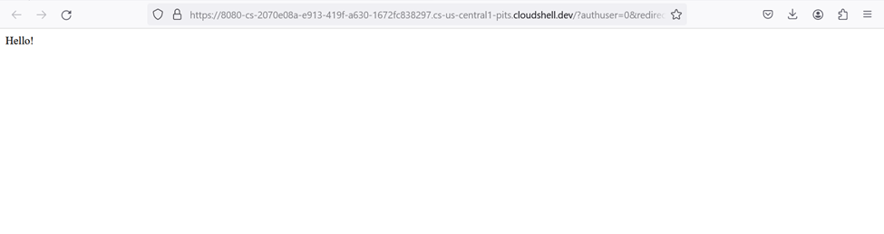
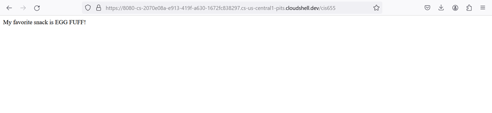

# 🌍 Project-5: Simple RESTful Application 

## 🚀 Setting Up and Configuring a RESTful API for Microservices Integration

### **Step 1: Setup and Configuration for RESTful Application**

1. **Objective**:  
   Create a RESTful API on Google Cloud using Compute Engine, enabling communication between microservices. This API will allow services to send and receive data efficiently.

2. **Tools/Services Used**:  
   - **Google Cloud Console** (Compute Engine, Cloud Shell)
   - **Flask Framework** (for Python) or **Express Framework** (for Node.js)

3. **Initial Setup**:
   - **Create a Compute Engine Instance**: Set up a virtual machine instance on Google Cloud Platform.
   - **Access via Cloud Shell**: After setting up the instance, access it through Cloud Shell to deploy your RESTful API.
   
### **Step 2: Implementing the RESTful API**

1. **Create a Simple RESTful Service**:  
   Using Flask (Python) or Express (Node.js), you can create a basic web service to handle HTTP requests.
   - Example for Flask (Python):
     ```python
     from flask import Flask
     app = Flask(__name__)

     @app.route('/hello')
     def hello():
         return "Hello, World!"

     @app.route('/snack')
     def snack():
         return "My favorite snack is EGG-PUFF"

     if __name__ == '__main__':
         app.run(host='0.0.0.0', port=80)
     ```

2. **Define Routes and Responses**:
   - The `/hello` route will return "Hello, World!"
   - The `/snack` route will return "My favorite snack is EGG-PUFF"
   
3. **Run the Application**:
   - Execute the Python script to start the server and handle incoming requests.

### **Step 3: Testing the RESTful Endpoints**

1. **Use Curl or Web Browser for Testing**:
   - Test the `/hello` endpoint by running:
     ```bash
     curl http://[Your-Compute-Engine-IP]/hello
     ```
     Expected output: "Hello, World!"
   - Test the `/snack` endpoint by running:
     ```bash
     curl http://[Your-Compute-Engine-IP]/snack
     ```
     Expected output: "My favorite snack is EGG-PUFF"
   
2. **Take Screenshots**:
   - Capture screenshots of the responses from these endpoints (via browser or curl), as evidence of the working API.

### **Step 4: Screenshots Demonstrating Application in Action**

1. **Screenshot 1 - Hello API Response**:
   - Shows the output of calling `http://[Your-Compute-Engine-IP]/hello`:
     ```
     Hello, World!
     ```


2. **Screenshot 2 - Snack API Response**:
   - Shows the output of calling `http://[Your-Compute-Engine-IP]/snack`:
     ```
     My favorite snack is EGG-PUFF
     ```


## 🌟 RESTful Services Integration for Microservices Communication

### **Step 1: Enabling Microservices Communication with RESTful APIs**

1. **Intermediary Layer for Communication**:
   - **RESTful APIs act as intermediaries** between microservices, allowing services to interact by sending HTTP requests.
   - Each microservice exposes an API endpoint, and these endpoints allow other services to request data or trigger actions in a standardized way.

2. **Cloud-Based Applications**:
   - Your application could integrate external services (e.g., weather data or payment gateways) using RESTful APIs.
   - For example, you might call a weather API to fetch live weather data or connect to a payment gateway to process payments, enabling external communications via RESTful services.

### **Step 2: Key Takeaways from RESTful Integration**

1. **Modular System Design**:
   - RESTful services allow you to build modular applications, where each component (microservice) is independent but communicates seamlessly through defined endpoints.

2. **Microservices Ecosystem**:
   - By using RESTful APIs, microservices can be developed and deployed independently, reducing dependencies between components and increasing scalability.

### **Step 5: Step-by-Step Process for Rebuilding the Application**

If you wish to replicate or clarify your approach, here’s the step-by-step breakdown:

1. **Create Compute Engine Instance**:
   - Set up a VM instance in Google Cloud Platform to host your RESTful API.

2. **Install Necessary Software**:
   - For Python (Flask):
     ```bash
     sudo apt-get update
     sudo apt-get install python3-pip
     pip3 install flask
     ```

3. **Develop RESTful Application**:
   - Create a file (`app.py`) with routes for `/hello` and `/snack` using Flask.

4. **Run the Flask Application**:
   - Execute the app using `python3 app.py`, and verify that it’s running by accessing it via `http://[Your-Compute-Engine-IP]/hello` and `http://[Your-Compute-Engine-IP]/snack`.

5. **Test the API**:
   - Use Curl or a browser to ensure that the API works and returns the expected responses.

6. **Optional – Integrate External APIs**:
   - To extend the functionality, integrate third-party services like weather or payment APIs to demonstrate seamless communication between microservices and external systems.

### **Summary**

You’ve successfully built and deployed a **RESTful API** using Google Cloud services, enabling communication between microservices via simple HTTP endpoints. By integrating external APIs and modularizing your services, you can scale your application and make it more versatile.
