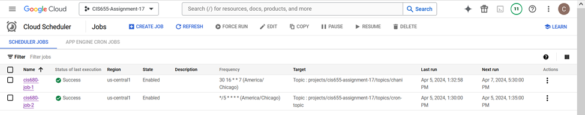
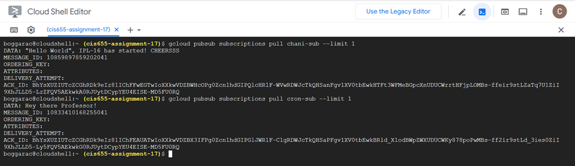

### **Project 7: Enhanced Cloud Observability with Scheduler and Tasks**

#### **Objective**:
In this project, I enhanced cloud observability by creating automated tasks with **Google Cloud Scheduler** to run jobs at specific intervals and integrate with **Pub/Sub** for message-driven automation. These tasks were designed to run on a schedule and demonstrate how logging and monitoring can be automated and integrated.

### What is a Cron Job?

A **Cron job** is a time-based job scheduler in Unix-like operating systems, including Linux and macOS. It is used to run scripts, commands, or tasks automatically at specified intervals. Cron jobs are defined by cron expressions, which specify the frequency and time for executing the job.

A cron job consists of:
- **Minute**: 0-59
- **Hour**: 0-23
- **Day of the month**: 1-31
- **Month**: 1-12
- **Day of the week**: 0-6 (where 0 is Sunday)

Example Cron Expression:
```plaintext
*/5 * * * *   # This runs a job every 5 minutes
```

### How Does It Help Us?

Cron jobs are incredibly useful for automating repetitive tasks, saving time and ensuring consistency. Instead of manually running tasks at specific times, a cron job can be set up to execute automatically according to a defined schedule. This is particularly helpful for system administration, batch processing, maintenance tasks, and notifications.
```

### 2. **In a Dedicated Section About Scheduler:**
If your project involves a specific feature for scheduling, you can create a separate section in the README for **Google Cloud Scheduler** and **Cron Jobs**. 

Example:
```markdown
## Google Cloud Scheduler & Cron Jobs

In this project, we leverage **Google Cloud Scheduler** to run tasks at specific intervals. **Cron Jobs** are used to automate the execution of tasks, ensuring they run without manual intervention.

### What is a Cron Job?

A **Cron job** is a time-based job scheduler that allows us to schedule tasks to run at defined times or intervals. Cron expressions are used to specify when a job should be triggered, such as every minute, hour, day, or week.

Example:
```plaintext
*/5 * * * *   # Runs a job every 5 minutes
```

### How Cron Jobs Help

Cron jobs allow us to automate various cloud functions such as sending notifications, performing data processing tasks, and monitoring system resources. They save time, reduce human error, and ensure our system is running smoothly without requiring manual intervention.
```

### 3. **In the Section for Tasks/Functionality:**
If you have a section in your README that explains the tasks or functionality that your project implements, you can place the explanation of Cron Jobs there, specifically if your project includes scheduled jobs.

Example:
```markdown
## Key Functionalities

### Scheduled Jobs with Cron

One of the core features of this project is the use of **Cron Jobs** to automate the execution of tasks. By defining cron expressions, we schedule jobs to run at regular intervals, ensuring that certain tasks like data updates or notifications occur automatically.

For instance:
- A cron job can be scheduled to run every 5 minutes:
  ```plaintext
  */5 * * * *
  ```

This ensures timely execution of critical tasks without requiring manual triggers, enhancing the efficiency and automation of our system.
```

### 4. **In the Conclusion or Future Improvements Section:**
If you have a conclusion or future improvements section in your README, you can mention how Cron Jobs will be helpful for expanding the project's functionality.

Example:
```markdown
## Future Improvements

As we continue to develop this project, **Cron Jobs** will play an important role in automating more tasks, reducing manual intervention, and increasing the efficiency of the system. These jobs can be used for regular maintenance, reporting, and even scaling tasks depending on project needs.
```

### **1. Create an Additional Job (cis680-job-2)**

For this task, we created an additional job in **Google Cloud Scheduler** to run at regular intervals. Here's how to do it:


#### **Steps to Create the Job:**

1. **Navigate to Google Cloud Console**.
   - Go to **Cloud Scheduler**.
   
2. **Create a New Job**:
   - Click **Create Job**.
   - Enter the following details for the job:
     - **Name**: `cis680-job-2`.
     - **Frequency**: Specify how often the job should run (e.g., every 5 minutes).
     - **Timezone**: Select the timezone relevant to your location.
     - **Target**: Choose **Pub/Sub** to publish messages.
     - **Topic**: Select or create a new Pub/Sub topic (for example, `cis680-topic`).



### **2. Set the Job to Run Every 5 Minutes**

For the job to run every 5 minutes, we need to set a cron schedule. Here's how you can set the cron schedule for your job:


#### **Steps to Set Cron Schedule:**

1. **Edit the Cron Expression**:
   - In the **Cloud Scheduler** job settings, set the **frequency** as:
     ```plaintext
     */5 * * * [DAY_OF_WEEK]
     ```
     Replace `[DAY_OF_WEEK]` with the appropriate numerical value for the day you are turning in the assignment (e.g., `1` for Monday, `5` for Friday, etc.).

2. **Fill in Cron Expression**:
   - The cron expression for running every 5 minutes on a specific day will look like:
     - For **Monday** (1), it would be: 
       ```plaintext
       */5 * * * 1
       ```

### **3. Create a Second Pub/Sub Topic with a Payload**

In this step, you will create a second **Pub/Sub topic** and configure a message that says "Hey there Professor!" to be sent whenever the job runs.

#### **Steps to Create Pub/Sub Topic and Payload**:

1. **Create Pub/Sub Topic**:
   - Go to **Google Cloud Console**.
   - Navigate to **Pub/Sub**.
   - Click **Create Topic**.
   - Name the topic (e.g., `cis680-topic-2`).

2. **Configure the Payload**:
   - When setting up the **Cloud Scheduler** job, ensure that the **payload** you send with the job includes the message: `"Hey there Professor!"`.

3. **Command to Pull Messages**:
   - To verify the message sent by your job, run the following command in your **Google Cloud Shell** to pull messages from the Pub/Sub subscription:
     ```bash
     gcloud pubsub subscriptions pull [YOUR_SUBSCRIPTION_NAME] --limit=1 --auto-ack
     ```
     Replace `[YOUR_SUBSCRIPTION_NAME]` with the name of the subscription for your topic.

4. **Output of Command**:
   - After running the above command, you should see the following message in your terminal:
     ```plaintext
     Hey there Professor!
     ```

### **Example Output for Pull Command**:

After executing the `gcloud` pull command, you should see something like:
```plaintext
Pulling messages from the subscription...
Message:
  Message ID: [ID]
  Data: "Hey there Professor!"
```


#### **Conclusion**

In this project, I demonstrated the use of **Google Cloud Scheduler** to automate tasks by creating jobs that trigger Pub/Sub messages. Additionally, I learned how to customize cron schedules to run jobs at specific intervals and tested Pub/Sub integration by pulling messages from the topic. This enhanced the observability of cloud functions and tasks while automating the process of sending messages.