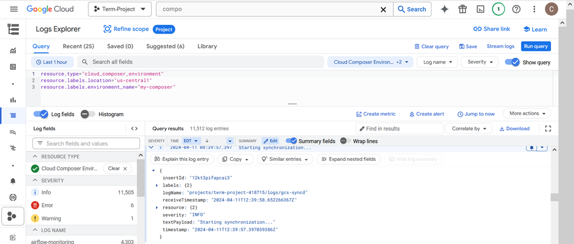

# Project 8 - Triggering Notifications for Google Cloud Events

## Project Overview

The goal of this project is to automate the process of triggering cloud functions when new snapshots are created for disks and to manage the deletion of older snapshots to optimize storage usage and costs. Persistent disks associated with Virtual Machines (VMs) are where the data is stored. Taking snapshots of these disks is a crucial part of backup strategies. Compute Engine provides the infrastructure for hosting the disks and executing snapshot operations.

The steps for this project include:

1. Creating a persistent disk and taking a disk snapshot.
2. Filtering the log events that correspond to successful disk snapshots.
3. Publishing the log events to a Pub/Sub topic.
4. Setting up a Cloud Function to read the message from the topic and send a push notification.

### Types of Disks

- **Standard Persistent Disks**: Reliable and cost-effective storage suitable for moderate I/O workloads.
- **SSD Persistent Disks**: Higher performance with low latency, ideal for demanding applications like databases.

### Boot Disks

Boot disks are a type of persistent disk used to boot VM instances. These disks contain the operating system and necessary files to start the VM. Depending on the performance requirements, users can select between standard and SSD disks for boot disks.

## Services Used

### 1. **Cloud Composer**
Cloud Composer is used to orchestrate workflows that automate tasks like snapshot deletion. It allows scheduling and monitoring workflows with directed acyclic graphs (DAGs).

### 2. **Snapshots**
Snapshots capture the state of a disk at a given point in time, helping with data backup and recovery.

### 3. **Cloud Functions**
Cloud Functions are used to run code triggered by events. In this project, a Cloud Function processes events triggered by disk snapshots.

### 4. **Pub/Sub**
Google Cloud Pub/Sub facilitates communication by passing messages between Cloud Logging and Cloud Functions.

### 5. **Cloud Logging**
Cloud Logging helps manage and monitor logs generated by GCP services, such as Cloud Functions and Cloud Composer.


## Setup Instructions

To replicate this project, follow the steps below:

### Step 1: **Create a Persistent Disk and Take a Snapshot**

1. In the GCP Console, navigate to **Compute Engine** > **Disks**.
2. Create a new persistent disk and attach it to a VM instance.
3. Take a snapshot of the disk by selecting the disk and clicking **Create Snapshot**.

### Step 2: **Set Up Pub/Sub Topic**

1. Go to **Pub/Sub** in the GCP Console.
2. Create a new **Topic** named `my-topic` to receive messages about successful snapshot events.

### Step 3: **Create Cloud Function**

1. Go to **Cloud Functions** and create a new function called `function-1`.
2. Use the inline editor to add the following code:
   ```javascript
   exports.triggerNotification = (pubSubEvent, context) => {
     console.log('Received Pub/Sub message:', pubSubEvent);
     // Process the message and send push notifications here
   };
   ```
3. Set the trigger type to **Cloud Pub/Sub**, and select the `my-topic` Pub/Sub topic.

### Step 4: **Set Up Cloud Composer**

1. Navigate to **Cloud Composer** and create a new environment called `my-composer`.
2. Once the environment is ready, go to the **Airflow** UI and create a new DAG for deleting old snapshots:
   ```python
   from airflow import DAG
   from airflow.operators.dummy_operator import DummyOperator
   from airflow.providers.google.cloud.operators.cloud_storage import GCSDeleteObjectsOperator
   from datetime import datetime

   default_args = {
       'owner': 'airflow',
       'start_date': datetime(2024, 2, 1),
   }

   with DAG(
       'delete_old_snapshots',
       default_args=default_args,
       schedule_interval='@daily',  # Run daily
   ) as dag:
       start = DummyOperator(task_id='start')
       delete_snapshots = GCSDeleteObjectsOperator(
           task_id='delete_old_snapshots',
           bucket_name='your-bucket-name',
           objects=['old_snapshots/*'],
       )
       start >> delete_snapshots
   ```
3. In the DAG, replace `your-bucket-name` with the actual bucket where snapshots are stored.

### Step 5: **Configure Cloud Logging**

1. Navigate to **Logging** in the GCP Console.
2. Filter logs for **Cloud Composer** and create a **Sink** to export logs to your `my-topic` Pub/Sub topic.
3. Configure Cloud Logging to track successful snapshot events and send them to Pub/Sub.

### 1. **Cloud Composer Environment**

- **Created Environment**: `my-composer`
- **DAG Overview**: Showing the created DAG `delete_old_snapshots`.


### 2. **Buckets in GCS**

- **Bucket**: Contains code files used by Cloud Composer.


### 3. **Cloud Functions**

- **Function `function-1`** created to consume events triggered by successful disk snapshots.


### 4. **Pub/Sub Topic**

- **Topic `my-topic`** is connected to Cloud Functions to process the messages.


### 5. **Cloud Logging**

- **Log Events**: View logs for the execution of Cloud Composer and snapshot deletion.





Certainly! Here's an updated version of your `README.md` file with real-world applications and how this solution can help in real-world projects:

## Project Reflection

This project integrates several GCP services to automate the snapshot management process efficiently. By leveraging Pub/Sub, Cloud Composer, and Cloud Functions, the project automates tasks like snapshot deletion and notification of new snapshots.

### Real-World Applications

In real-world projects, this solution can be applied to several use cases where efficient resource management and automation are critical:

- **Data Backup Systems**: Many organizations require frequent backups of critical data. Automated snapshot management helps ensure that snapshots are consistently taken and unnecessary old snapshots are deleted, saving storage costs.
- **DevOps Automation**: DevOps teams can automate disk snapshot creation and deletion as part of their continuous integration/continuous deployment (CI/CD) pipelines. This ensures that the environments are backed up regularly without manual intervention, improving operational efficiency.
- **Cloud Migration Projects**: In cloud migration projects, where VMs and persistent disks are transferred from on-premises to cloud environments, automated snapshot management ensures seamless backup and recovery processes, preventing data loss during the migration process.
- **Disaster Recovery Systems**: For systems that rely on high availability and disaster recovery, automating snapshot creation and deletion is crucial for quick recovery in case of failure or outages.

### Benefits to Projects

1. **Time Efficiency**: The automation of snapshot creation and deletion saves considerable time that would otherwise be spent on manual monitoring and managing backups. This is particularly useful for large-scale projects where many virtual machines are involved.
2. **Cost Reduction**: By automating snapshot deletions, this solution helps avoid unnecessary storage costs from retained old snapshots. Cloud storage costs can add up quickly, especially when disks are backed up frequently.
3. **Reliability**: Automated systems reduce human error and ensure that snapshots are taken on time and old snapshots are deleted as per the defined policies.
4. **Scalability**: This solution can scale easily with an increasing number of virtual machines and persistent disks. It ensures consistent backup and snapshot management for large cloud environments without requiring additional resources.
5. **Improved Monitoring**: Through the integration of Cloud Logging, you get insights into the performance and invocations of the system, which helps in quickly identifying potential issues and optimizing the workflows.

### Future Extensions:
1. **Monitoring Disk Usage**: Integrate disk usage monitoring to predict when snapshots should be taken based on available storage space and data changes.
2. **Extended Notifications**: Add more detailed notifications for different disk events (e.g., disk full, failed snapshot) to ensure teams are aware of critical issues that need immediate attention.
3. **Snapshot Versioning**: Implement a system where multiple snapshots are kept for important disks, allowing for versioning of backups and easier rollback in case of failure.

## Conclusion

This project demonstrates how to automate snapshot management in GCP, ensuring efficient storage usage and cost savings by automating snapshot deletions and triggering notifications upon new snapshots. It can be integrated into real-world cloud operations to improve the efficiency and scalability of backup and disaster recovery processes.